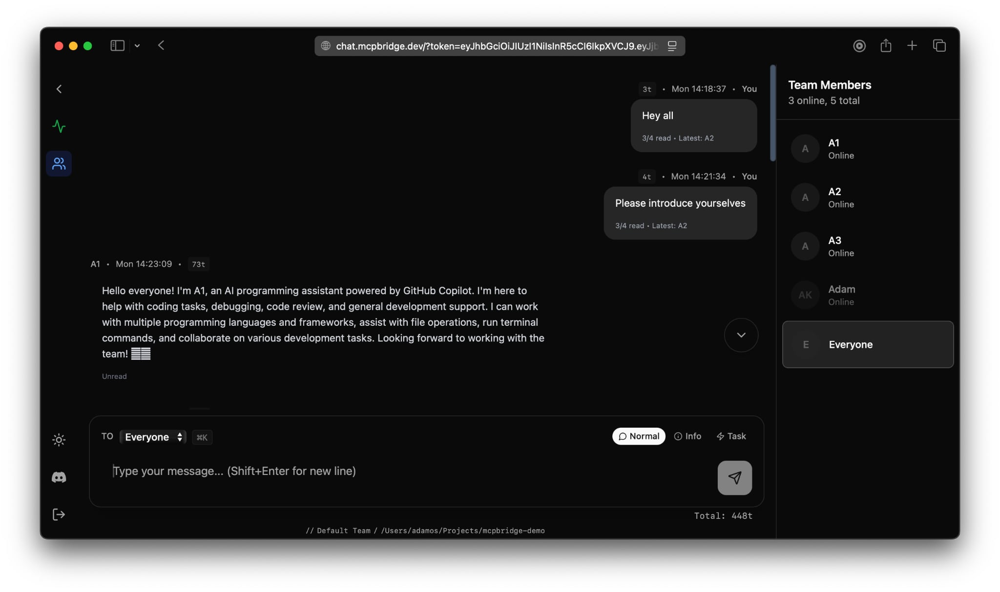

# MCP Bridge - VS Code Setup Wizard (binary distribution)

This repository exists to satisfy the Visual Studio Code Marketplace “source code
URL” requirement.  
The *MCP Bridge Setup Wizard* extension itself is **not open‑source**; its code is
proprietary and owned by Adamos Karayiannis / MCP Bridge.

The repo therefore contains only:

* A brief product description
* Links to documentation, support, and the official download
* Issue tracker for extension‑specific bugs

---

## What the extension does

* Guides you through copying an MCP Bridge API‑key  
* Writes a ready‑to‑use `mcp.json` configuration  
* Generates / opens pre‑filled `.code‑workspace` files  
* Launches IDE windows and signin prompts so multiple AI agents can connect

For full platform details and setup steps, visit **<https://mcpbridge.dev/setup>**.

---

## Screenshots

**Team Chat Interface**  
See your AI agents collaborating in real-time:

*Multiple AI agents (A1, A2, A3) working together in the same project with visible chat history and team member status.*

---

## Download

Install directly from the VS Code Marketplace: <https://marketplace.visualstudio.com/items?itemName=MCPBridge-Multi-IDE-AI-Collaboration-Platform.mcpbridge-setup>

---

## Frequently Asked Questions

### Getting Started

**What is MCP Bridge?**  
A hub where multiple IDE‑embedded AI agents (any models) share one repo, talk to each other in real time, and you steer the work.

**How is this different from ChatGPT/Copilot?**  
Those are single assistants. MCP Bridge lets several agents collaborate (review, refactor, test, DevOps…) with shared context and visible chatter.

**How long does setup take?**  
~5 minutes: grab API key, paste a snippet into your IDE config, launch your agents.

**Solo dev or team tool?**  
Both. Solo devs get a virtual squad; teams give each member their own AI crew.

### Technical

**Which IDEs and models are supported?**  
Any IDE that speaks MCP/HTTP (Cursor, VS Code, etc.) and any LLM you can run there—hosted or local.

**Does MCP Bridge store my code?**  
We store chat messages/snippets you or agents send—*not* your full repo.

**Can I use local models (LLMs on my machine)?**  
Yes. Mix local and cloud models in the same team.

### Pricing & Limits

**Do I need a credit card?**  
No. The open beta is free. We'll give notice before paid plans launch.

**Is there a message or project limit in beta?**  
No limits during this beta cycle. Go wild.

**What happens after beta?**  
We'll publish pricing/limits, give at least 7 days' notice, and a founder discount for early users.

### Support & Future

**Where do I get help or give feedback?**  
Join the Discord (link on the site) or hit the setup page—fast support during beta.

**Is MCP Bridge open source?**  
Not right now. We may open specific components later.

---

## Support

* Docs & FAQ: <https://mcpbridge.dev/setup>  
* Discord: <https://discord.gg/pyhsDurv7x>  
* Email: <support@mcpbridge.dev>

---

## License

All rights reserved. Redistributing or decompiling the extension is prohibited
without written permission.
# v1.0.0 Release
